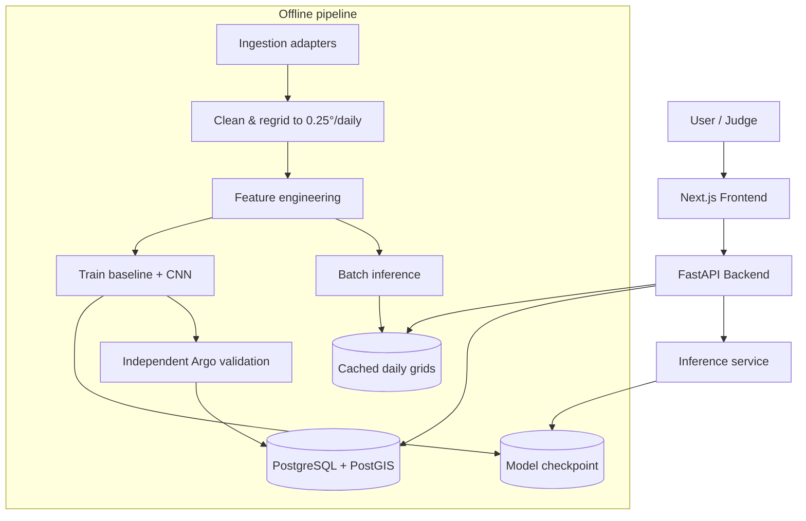

# ARCHITECTURE — GAHAN (SIH26066 · OceanEmbed)

*Condensed architecture reference. Full detail: `docs/08_SYSTEM_ARCHITECTURE.md`, `docs/09_DATA_PIPELINE.md`, `docs/11_GIS_STRATEGY.md`, `docs/13_API_SPECIFICATION.md`, `docs/14_DATABASE_SCHEMA.md`.*

## Stack

| Layer | Choice |
|---|---|
| Frontend | Next.js + TypeScript + Tailwind + MapLibre GL + Deck.gl + Recharts |
| Backend | FastAPI (Python), REST |
| Database | PostgreSQL + PostGIS |
| Object storage | Zarr/GeoTIFF (Supabase Storage or Cloudflare R2) |
| ML | LightGBM baseline + PyTorch CNN/U-Net; `xarray`, `xesmf`, `argopy`, `copernicusmarine`, `cdsapi` |
| Deployment | Vercel + Render + Supabase |

## Diagram



## Why this stack (not over-engineered)

No Kubernetes, no message queue, no dedicated model-serving framework — the entire demo dataset is precomputed and small (a few GB); a single FastAPI process reading cached Zarr/GeoTIFF is sufficient. Full reasoning: `docs/08_SYSTEM_ARCHITECTURE.md` §8, `docs/18_DEPLOYMENT.md`.

## Repository layout

See `docs/09_DATA_PIPELINE.md` §2 for the full annotated tree (`frontend/`, `backend/`, `ml/`, `scripts/`, `docs/`, `tests/`, `docker/`).

## Analysis & data layer (as built)

```
ml/science/            numpy + gsw, no I/O: stratification.py · seawater.py (TEOS-10) · forecast.py · volume.py
ml/qc_rules.py         QC constants shared by the pipeline and the Data Quality API
backend/app/api/       analysis.py (stratification, ts-profile, forecast, volume) · datasets.py (surface, wind, salinity,
                       data-quality, provenance) — handlers validate, fetch, assemble; science stays in ml/science
backend/app/schemas.py Pydantic response models + the provenance classification vocabulary
backend/app/services/  catalog.py (lineage, layer availability, data-quality statistics) · observations.py (nearest
                       native Argo profile: PostGIS, falling back to processed/argo_profiles.parquet)
```

Optional datasets are precomputed offline (`processed/inputs.zarr` for SLA/wind, `processed/salinity.zarr` for
GLORYS salinity when credentials exist) and reported per layer in `/v1/meta` as available / not_configured /
not_precomputed; the API never downloads during a request.
