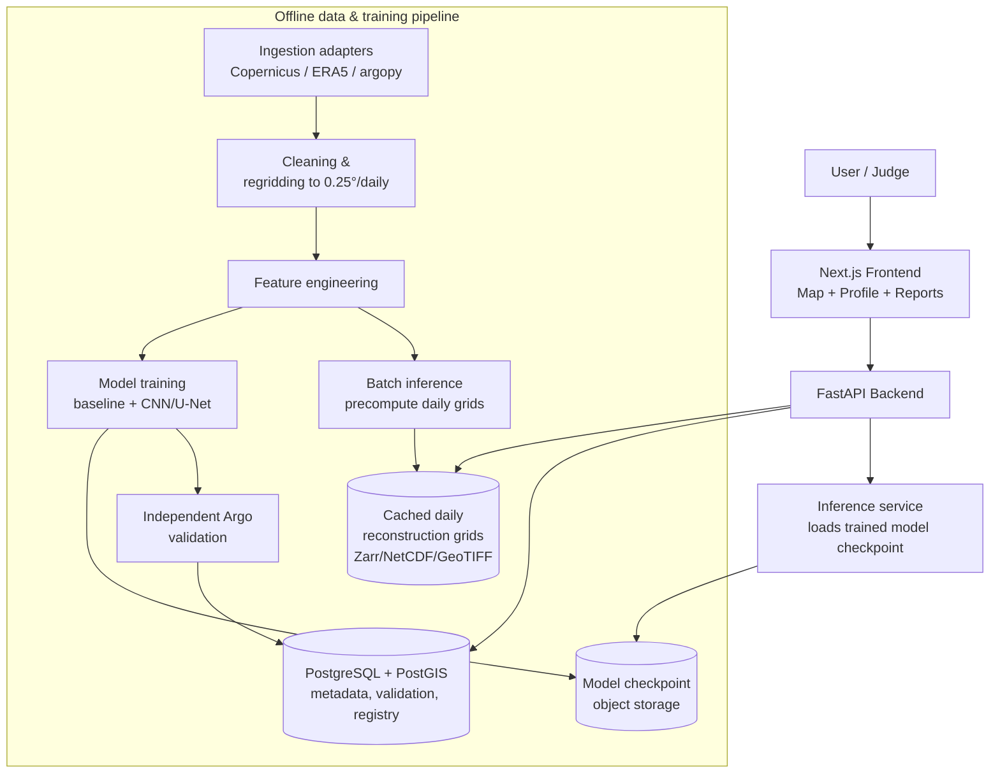

# 08 · Technical Architecture

## 1. Guiding principle

Small team, little time, real data, real validation, one clear architecture — not the most sophisticated stack that could theoretically be built. Every choice below is picked because it lets a 4–6 person student team finish a *working* system, not because it's the most impressive-sounding option.

## 2. Frontend

**Chosen: Next.js (App Router) + TypeScript + Tailwind CSS + MapLibre GL JS + Deck.gl (for raster/heatmap overlays) + Recharts (for profile/time-series charts).**

| Option considered | Verdict | Why |
|---|---|---|
| Next.js + TypeScript + Tailwind | ✅ Chosen | Fast to scaffold, huge ecosystem, easy deploy to Vercel, one language (TS) across API routes and UI if needed |
| MapLibre GL | ✅ Chosen over Mapbox GL | Open-source, no API-key billing risk mid-demo, vector+raster tile support is sufficient — Mapbox's extra polish isn't needed here |
| Deck.gl | ✅ Chosen for gridded raster/heatmap layers | Purpose-built for exactly this kind of large-array geospatial overlay (WebGL-accelerated); pairs natively with MapLibre |
| Cesium (3D globe) | ❌ Not chosen | This is a 2D regional grid problem (0.25° lat/lon), not a 3D-globe or terrain problem — Cesium would be over-engineering |
| Recharts | ✅ Chosen for the depth-profile and time-series charts | Simple, well-documented, sufficient for line/area charts; no need for Three.js-level custom rendering |

## 3. Backend

**Chosen: FastAPI (Python) + REST, no WebSockets needed for MVP.**

- Python is mandatory in practice anyway (the ML stack — xarray, PyTorch/TensorFlow, argopy — is Python), so FastAPI keeps the whole backend in one language and lets the ML team's inference code sit directly behind the API with no cross-language serialization step.
- REST is sufficient: every request (get map layer for date X depth Y, get profile at point, get validation stats) is a simple request/response, not a live stream. WebSockets would add complexity for no user-facing benefit at this scope.

## 4. Database & storage

**Chosen: PostgreSQL + PostGIS for metadata/validation records, object storage (local disk or S3-compatible) for large gridded arrays as GeoTIFF/Zarr, not stuffed into the relational DB.**

| Data kind | Where it lives | Why |
|---|---|---|
| Argo profile metadata, validation scores, model registry, region/date catalogue | PostgreSQL + PostGIS | Structured, relational, needs spatial queries ("nearest Argo float to this point") — PostGIS's `ST_DWithin`/`ST_Distance` are exactly the right tool |
| Gridded daily reconstruction output (100×240×15 depths) | Pre-computed Zarr/NetCDF/GeoTIFF files on disk (or S3-compatible object storage) | Large multi-dimensional arrays belong in array-native formats, not relational rows — this is standard geospatial/scientific-computing practice, not a shortcut |
| Model checkpoints | Object storage + a `model_registry` table pointing to them | Versioning without bloating the DB |

Supabase is a reasonable *hosted* Postgres+PostGIS+object-storage option if the team wants one managed service instead of three (see `18_DEPLOYMENT.md`).

## 5. AI/ML layer — where AI provides *measurable* value (and where it doesn't)

| Task | Genuinely needs ML? | Chosen approach |
|---|---|---|
| Surface→depth temperature reconstruction | **Yes — this is the PS's core ask** | Gradient-boosting baseline + CNN/U-Net encoder-decoder as primary (see `10_ML_AI_STRATEGY.md`) |
| "Satellite embedding" generation | **Yes — explicitly required by PS wording** | The CNN/U-Net's bottleneck activations *are* the embedding; no separate model needed |
| Uncertainty estimation | Yes, but classical (quantile regression / ensemble spread), not exotic | Adds real decision-support value — a number without a confidence band is less useful, not "AI for AI's sake" |
| Natural-language summary of a region ("Wow" feature #20) | Optional — nice-to-have, not core | A single templated LLM call over already-computed numbers; **the MVP works fully without it** — this is stated explicitly per Research Rule #6 |
| Anomaly detection, RAG, knowledge graphs, agentic AI | **No** | None of these map to a genuine gap in this specific PS — including them would be AI-for-its-own-sake and is explicitly excluded |

## 6. Architecture diagram

## 7. Data ingestion, preprocessing, feature engineering, inference — where they run

- **Ingestion & preprocessing run offline, in batch**, ahead of the demo (see `09_DATA_PIPELINE.md`) — this is standard practice for a PoC over a fixed historical study period (e.g., 2015–2023), and is exactly what the "demo fallback" strategy (`26`-equivalent, `16_SECURITY_AND_PRODUCTION.md` §demo reliability) depends on: nothing in the live demo requires a flaky external API call.
- **Model inference for the demo is pre-computed and cached** for the study period, served instantly from disk/DB. A live "type any date, get a fresh inference" mode is a nice engineering flex but is **not** required for PS compliance and should only be attempted after the cached path works end-to-end.
- **Spatial queries** (nearest Argo float, region bounding-box lookups) use PostGIS spatial indexes (GiST), not application-level loops.
- **Caching**: precomputed grids are the cache; no separate Redis layer needed at this scale (100×240×15 arrays for ~10 years is a few GB at most — fits on disk/object storage, served directly).
- **Error handling & auth**: see `16_SECURITY_AND_PRODUCTION.md` for the hackathon-vs-production split — MVP needs basic input validation and graceful "data unavailable for this date" responses; no user authentication is needed for a judge-facing demo (adding login would be pure friction, not value).

## 8. Why this architecture is realistic for a small student team

Every component is something at least one Indian-college hackathon team ships successfully every SIH cycle: Next.js+FastAPI is one of the most common SIH stacks; PostgreSQL/PostGIS is a standard, well-documented combination; the ML stack (xarray/PyTorch/argopy) is the same one used by the prior-art repos in `03_EXISTING_SOLUTIONS.md`. Nothing here requires Kubernetes, microservices, message queues, or multi-region infrastructure — those would be over-engineering relative to the actual deliverable (a validated regional PoC), not a strength.
