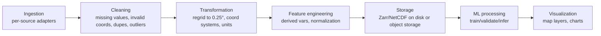

# 09 · Data Pipeline

## 1. Pipeline stages



### Ingestion
Each dataset (OSTIA SST, CMEMS SSS, DUACS SLA, GlobCurrent, ERA5 wind, GLORYS target, Argo) gets **one adapter script** with a common contract: `fetch(start_date, end_date, bbox) -> xarray.Dataset` with dims `(time, lat, lon)`. This is what makes swapping in an official INCOIS source later (`05_INDIA_DATA_SOURCES.md` §5) a one-file change.

### Cleaning
- Drop/flag land pixels (mask using each product's own land-sea mask or a bathymetry-free simple bounding check).
- Coerce longitude convention consistently (0–360 vs −180–180 — CMEMS and NASA products sometimes differ; standardize to one convention immediately after ingestion).
- Detect and log physically impossible values (SST < −2°C or > 40°C, salinity outside 0–45 PSU) rather than silently keeping them.
- De-duplicate any overlapping time steps from reprocessed/NRT product boundaries.

### Transformation
- **Regrid every input to the common 0.25°×0.25° grid** using `xesmf` (conservative or bilinear regridding) or `cdo remapbil` — this is the PS's own explicitly permitted step for datasets not natively at 0.25°.
- Coarsen GLORYS from 1/12° to 0.25° by area-weighted averaging (not simple subsampling, to avoid aliasing).
- Align all sources to a common daily timestamp convention (UTC midnight).

### Feature engineering
Per grid cell, per day, assemble the model input vector:
- Raw fields: SST, SSS, SLA, U_current, V_current, U_wind, V_wind (7 scalar channels).
- Static/derived: latitude, longitude (or sin/cos encoding), day-of-year (sin/cos encoding for seasonality), distance-to-coast (optional).
- Normalize each channel to zero mean/unit variance using **training-set-only** statistics (never leak validation/test statistics into normalization).

### Storage
- Processed tensors stored as **Zarr** (chunked, compressed, fast random access — ideal for ML dataloaders reading arbitrary date slices) under `data/processed/`.
- Raw downloads kept under `data/raw/` (gitignored — too large for git; document the download scripts instead of the data itself).

### ML processing
Training/inference as detailed in `10_ML_AI_STRATEGY.md`.

### Visualization
Backend serves precomputed daily reconstruction arrays as either (a) small PNG tiles for the map (fast, simple) or (b) raw grid JSON/GeoTIFF for Deck.gl to render client-side (richer interactivity, chosen approach — see `11_GIS_STRATEGY.md`).

## 2. Recommended repository folder structure

```
oceanembed/
├── frontend/                  # Next.js app
│   ├── app/
│   ├── components/
│   └── lib/
├── backend/                   # FastAPI app
│   ├── app/
│   │   ├── api/                # route handlers
│   │   ├── services/           # inference, derived-products, validation
│   │   ├── models/              # Pydantic schemas
│   │   └── db/                  # SQLAlchemy models, PostGIS queries
│   └── tests/
├── ml/
│   ├── data/
│   │   ├── raw/                 # gitignored downloads
│   │   └── processed/           # Zarr stores
│   ├── ingestion/               # one adapter script per data source
│   │   ├── fetch_sst.py
│   │   ├── fetch_sss.py
│   │   ├── fetch_sla.py
│   │   ├── fetch_currents.py
│   │   ├── fetch_winds.py
│   │   ├── fetch_glorys.py
│   │   └── fetch_argo.py
│   ├── pipeline/
│   │   ├── clean.py
│   │   ├── regrid.py
│   │   └── feature_engineering.py
│   ├── models/
│   │   ├── baseline_lightgbm.py
│   │   ├── cnn_unet.py
│   │   └── train.py
│   ├── evaluation/
│   │   ├── argo_validation.py
│   │   └── derived_products.py   # TCHP, MLD, D20/D26
│   └── notebooks/                 # exploratory analysis only, not production path
├── scripts/                    # one-off setup / demo-data-seeding scripts
├── docs/                       # ← this artifact
├── tests/                      # cross-cutting integration tests
├── docker/
│   ├── backend.Dockerfile
│   └── docker-compose.yml
├── .env.example
├── README.md
└── PRD.md / ARCHITECTURE.md / ROADMAP.md
```
